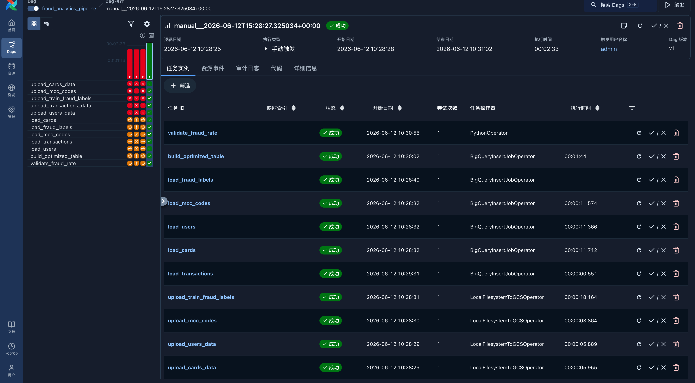

# 🏦 Fraud Analytics Pipeline on GCP

An end-to-end, production-style data pipeline that ingests 13.3M banking transactions, warehouses them in BigQuery, and orchestrates the whole flow with Apache Airflow. Built on Google Cloud Platform: **Cloud Storage → BigQuery → Airflow**.

This is the cloud-data-engineering counterpart to my [fraud-analytics-agent](https://github.com/IsabellaCcc/fraud-analytics-agent) project — the same dataset, rebuilt on a GCP warehouse and orchestrated as a real pipeline.

---

## Architecture

```
┌──────────────┐     ┌──────────────────┐     ┌─────────────────────┐     ┌────────────────┐
│  Local CSVs  │ ──► │  Cloud Storage   │ ──► │     BigQuery        │ ──► │   Validation   │
│  (5 tables)  │     │  (data lake/raw) │     │  raw + optimized    │     │  (fraud rate)  │
└──────────────┘     └──────────────────┘     └─────────────────────┘     └────────────────┘
        └────────────────────── orchestrated by Apache Airflow ──────────────────────┘
```

The Airflow DAG runs four stages:

1. **`upload_*`** — push each local CSV to a GCS bucket (data lake / raw zone)
2. **`load_*`** — load each GCS object into a raw BigQuery table
3. **`build_optimized_table`** — create a partitioned + clustered analytical table
4. **`validate_fraud_rate`** — assert the migrated data matches the expected fraud rate, failing the run if it drifts



---

## Why partitioning + clustering matters

The core data-engineering decision in this project is how the `transactions` table is physically laid out in BigQuery.

The optimized table is **partitioned by `DATE(date)`** and **clustered by `mcc, merchant_state`**. For a typical analytical query filtering on a date range, this dramatically reduces the bytes BigQuery has to scan:

| Table | Bytes scanned (1-year query) |
| --- | --- |
| Unoptimized `transactions` | ~260 MB |
| Optimized `transactions_optimized` | ~27 MB |

That's roughly a **90% reduction (10x less data scanned)** for identical results. Since BigQuery bills on bytes scanned, this is a direct, compounding cost saving on every query — the kind of optimization that matters at healthcare-data scale.

---

## Dataset

[Financial Transactions Dataset](https://www.kaggle.com/datasets/computingvictor/transactions-fraud-datasets) from Kaggle — a synthetic banking dataset spanning 2010–2019.

| Table | Rows | Description |
| --- | --- | --- |
| transactions | 13.3M | Core fact table: amount, merchant, payment method |
| cards | 6,146 | Card details per customer |
| users | 2,000 | Customer demographics and income |
| mcc_codes | 109 | Merchant category code descriptions |
| fraud_labels | 8.9M | Binary fraud labels (~0.15% fraud rate) |

---

## Tech Stack

- **Google Cloud Storage** — raw data lake
- **BigQuery** — cloud data warehouse; partitioning, clustering, query optimization
- **Apache Airflow** — pipeline orchestration (`LocalFilesystemToGCSOperator`, `BigQueryInsertJobOperator`, `PythonOperator`)
- **Python** — upload/load scripts and the Google Cloud SDKs
- **SQL** — analytical fraud queries (`fraud_queries.sql`)

---

## Project Structure

```
fraud-analytics-gcp/
├── gcs/
│   └── upload_to_gcs.py        # upload local CSVs to GCS
├── bigquery/
│   ├── load_to_bq.py           # load GCS files into BigQuery tables
│   └── fraud_queries.sql       # analytical fraud queries
├── airflow/
│   └── dags/
│       └── fraud_pipeline_dag.py   # the orchestration DAG
├── start_airflow.sh            # local Airflow launcher (env + venv)
└── README.md
```

---

## The Analysis

The `bigquery/fraud_queries.sql` file recreates the analytical queries from the original project natively in BigQuery, including:

- Overall fraud rate (validates the ~0.15% baseline)
- Fraud rate by merchant category (MCC)
- Fraud rate by card brand and type
- Fraud rate by state
- Fraud rate by hour of day
- Average transaction amount: fraud vs. legitimate
- Monthly fraud trend with a cumulative window function

---

## Running it locally

**Prerequisites:** a GCP project, the `gcloud` CLI, and a Python virtual environment.

1. **Create the GCS bucket and upload data**
   ```bash
   gsutil mb -l us-central1 gs://<your-bucket>/
   python gcs/upload_to_gcs.py
   ```

2. **Create the BigQuery dataset and load tables**
   ```bash
   bq --location=us-central1 mk --dataset <project>:fraud_analytics
   python bigquery/load_to_bq.py
   ```

3. **Start Airflow and trigger the DAG**
   ```bash
   ./start_airflow.sh
   # open http://localhost:8080 and trigger fraud_analytics_pipeline
   ```

> **Note:** the GCP service-account key and local Airflow runtime files are gitignored and never committed.

---

## What this project demonstrates

- Building a cloud data pipeline end to end on GCP, from raw files to a validated warehouse
- BigQuery cost and performance optimization through partitioning and clustering
- Pipeline orchestration with Airflow, including dependency management, retries, and a data-quality gate
- Handling real-world messiness — nested JSON sources, currency-formatted columns, partial label coverage — as part of the load process
